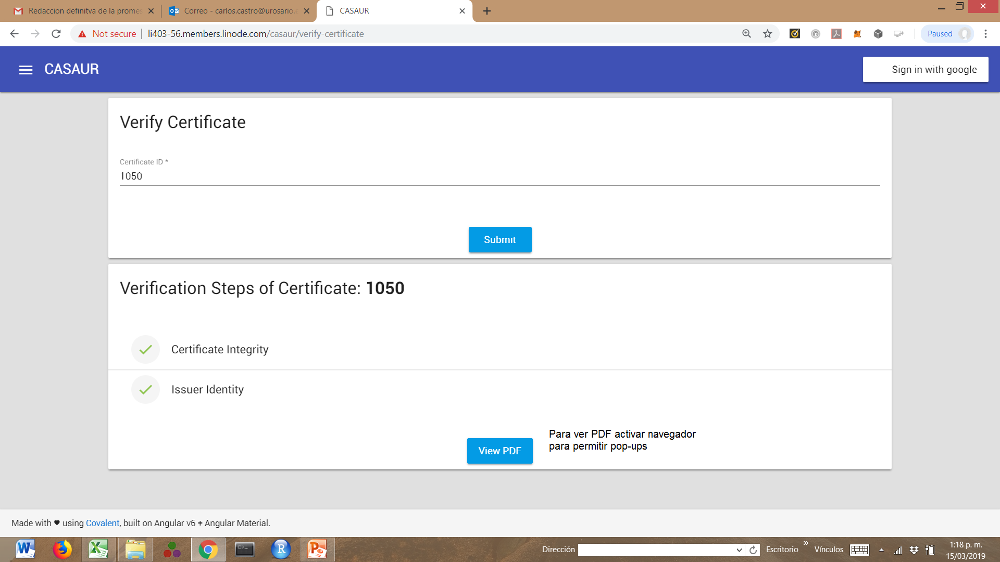

[Carlos Castro](index.md)|[Short Bio](cv.md)| [Research](res.md)|[Teaching](teach.md)|[Outside Activities](Outside.md)|[Finance](Fin.md)|[Jupyter Notebooks](Jup.md)|[Digital Diplomas](Ddiploma.md)|[Blockchain4openscience](Block.md)    

# [Hyperledger supporting Blockcerts compliant digital diplomas accross Colombian universities](https://www.youtube.com/watch?v=r2BGzIsB4ww&feature=youtu.be).

We have built an open source permissioned hyperledger blockchain for managing digital certificates based on the [Blockcert](https://www.blockcerts.org/about.html) open standard. Our proof of concept (PoC) makes it possible to verify certificates issued by universities; we are initially working with a simple certificate that can be easily extended to diplomas and badges. Our PoC delivers helps to prevent forgery; in addition, it also delivers a transparent-interoperable infrastructure that makes it possible to verify educational accomplishments.  Ours is the first step towards an open, interoperable and  verifiable educational experience. We are working with the Blockcerts standards in hyperledger and adapting it to the Colombian scenario.  Blockcerts is an open-source project initially led by MIT’s media lab and Learning Machine. Blockcerts focus has been on issuing certificates over third party platforms like Bitcoin and Ethereum. Our goal is to implement the certification process in a permissioned blockchain using the Hyperledger framework and define the semantics, in the form of an ontology, for this process in order to facilitate interoperability -idem data exchange. Moreover, we want to decouple the certification process from cryptocurrencies dependent platforms. [Universidad del Rosario](https://www.urosario.edu.co/Casa-ur/inicio/) provided the user case for the issuance of three types of certificates form CASA UR (administrative office within the university).

## Application: The application is currently running in a server deployed onto a simple Hyperledger Fabric network.
* [Backend in Hyperledger Composer](http://li403-56.members.linode.com:8080/)
* [Frontend, example to verify certificate 1050](http://li403-56.members.linode.com/casaur/verify-certificate)
* 

### Collaborators:
* [Alexander Garcia, Graz University of Technology (TU Graz), Austria.](https://www.researchgate.net/profile/Alexander_Garcia)
* [Federico Lopez, Developer, EBI, UK](https://github.com/ficolo)
* [Olga Giraldo, PhD student, Universidad Politécnica de Madrid, Madrid, Spain](https://github.com/oxgiraldo).
* [Camilo Casanova, Developer, Universidad del Valle, Cali, Colombia](https://github.com/Camilo1090).
* [Sergio Cardona, Developer, Universidad del Valle, Cali, Colombia](https://github.com/chechocardona)

<!---
## Problem statement
Students and employers/administrators often require  mechanisms to share and verify educational or professional accomplishments; prospective employers also need to verify these accomplishments with various degrees of granularity. Currently, students moving to a different university as well as job seekers, must provide certified paper copies of diplomas; sometimes the full transcripts are also required in order to assess skills and/or establish equivalences.  Diplomas and educational certificates are assets; people holding these kind of assets should be able to present them in a verifiable way to anyone they choose to.  Employers, universities as well as job applicants have to spend a significant amount of resources verifying these assertions. The alternative is to grant absolute trust on the validity of the documentation provided by the aspiring candidates. Trust but verify, is at the core of our development.  It is not uncommon to find news about public figures, politicians in particular,  claiming educational accomplishments that are false or exaggerated.   It is also not uncommon to forge diplomas and educational certificates in general.
## Why this technology?
A permissioned public blockchain provides a way for institutions, e.g. universities, to issue the educational accomplishments in a way that can be easily verified by the general public: students, employers, and journalist. Schools within universities can easily write the information onto the blockchain but at the same time may keep some control over the validity of the claim. For example, a certificate maybe revoked if the student violated a code of conduct or a certificate or skill may at some point became obsolete and hence the certificate redundant. In addition student mobility across borders requires in some cases a process of validating the educational certificates attained in other countries. In some countries this is a lengthy verification process by a government agency; this role and the paper trail of the process can be avoided by relying on a standard regarding the information contained in a certificate and a system of verification of the claims. Blockcerts provides an open standard for recipient centric certificates and blockchain technologies provides a secure mechanism to verify the claims.
## Roadmap
Currently there is a working version of the [business network model that incorporates the Blockcerts standard using Composer and with the possibility of deploying the business network onto a Fabric network](https://github.com/Blockchain4openscience/blockdegree-frontend) supporting three clients: first, a university administrator at the central registry in charge of the designing a certificate template; second, a faculty administrator in charge of issuing the certificates to the students using the student roster and the certificate template; and third and external user (student or employer) that is able to retrieve and verify the certificate. We are currently working with Universidad del Rosario in Bogota, Colombia, to get a working prototype of the blockchain for issuing the digital diplomas by the end of 2018.
-->
